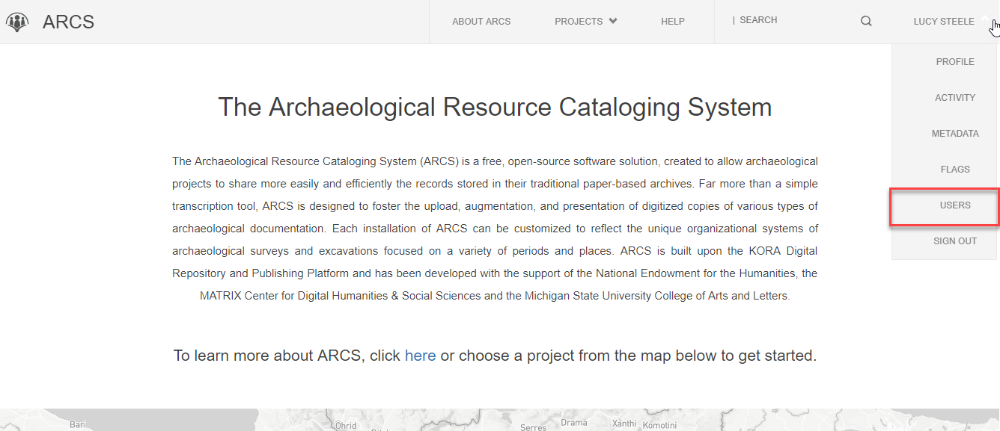
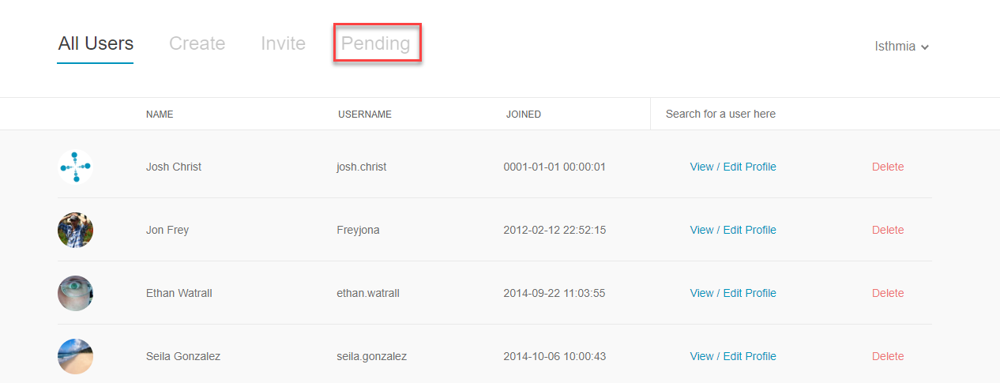
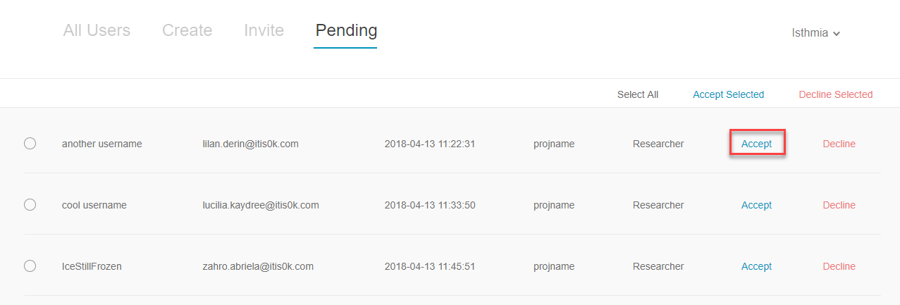
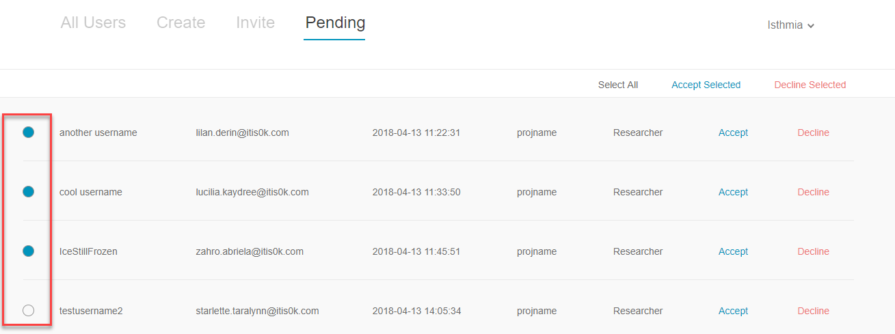

**4. Approve/Accept New User**

New accounts on ARCS must be accepted by an administrator to be confirmed. To approve/accept a new user,

1. Click **Users** on the drop-down menu below your name on any ARCS page.

2. On the **All Users** landing page, navigate to the **Pending** tab.

3. Click **Accept** on the far right of the user account you are choosing to approve.

4. You can select multiple pending accounts at a time by selecting **the circle to the left** of the usernames. This allows  you to bulk accept/decline new users.

