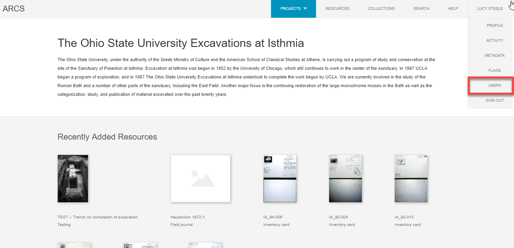
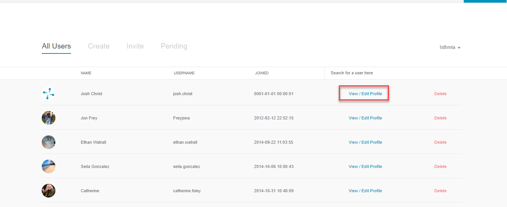

**5. Edit Existing User**

Administrators have the ability to edit existing users on ARCS. (I don't know the larger benefit of this to expand upon this intro) To edit existing users,

1. Navigate to the **All Users** landing page via the **Users** tab from the drop-down menu below your name.

2. On the **All Users** landing page, you can click **View/Edit Profile** to the right of any user account.

3. This will bring you to the profile of that user where  you can view and **can you edit?**
4. **There does not appear to be any editing functions on user profiles from the admin account I am working on.**
