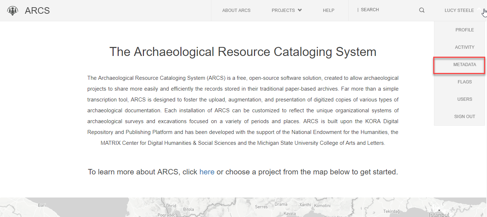
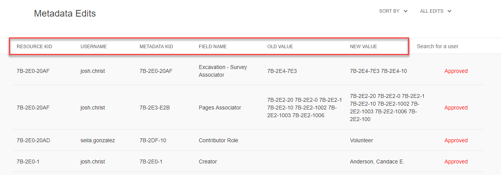
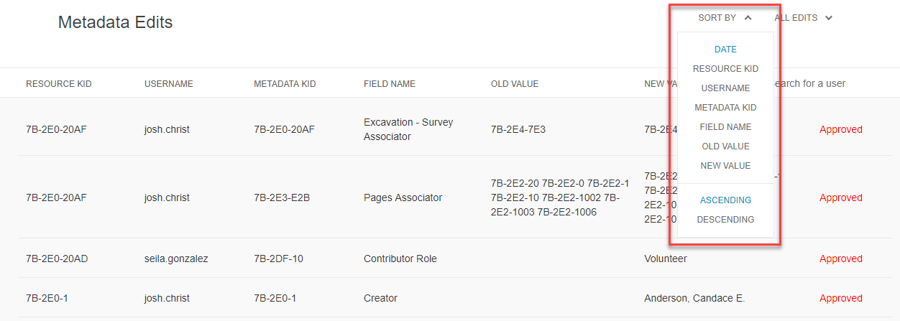
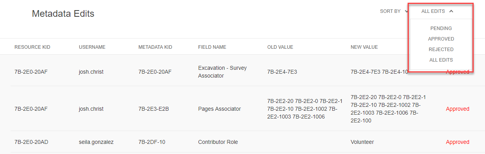
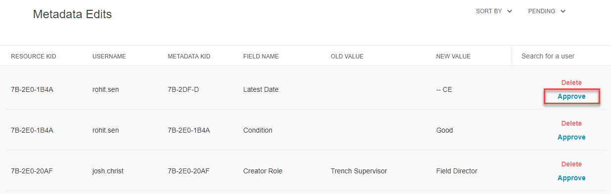
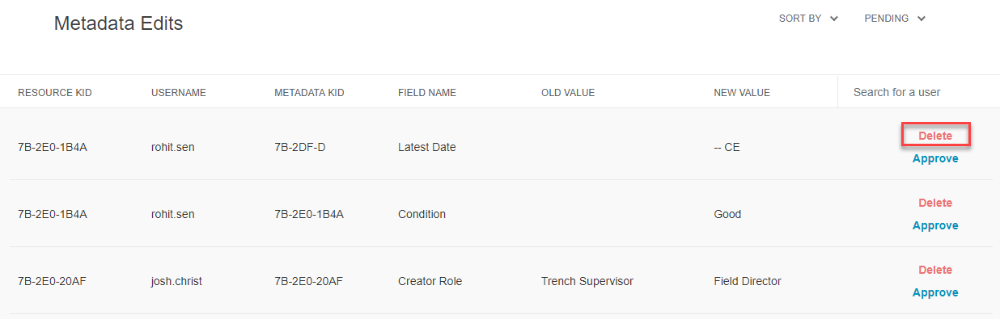

**7. Accept/Reject Proposed Metadata Edit**

Because ARCS is centered around user-generated content, users have the ability to add and edit metadata on resources. Administratos have the ability to accept or reject these edits.

To approve or reject proposed metadata edits,
1. Navigate to the drop-down menu under your name and select **Metadata.**

2. This will bring you to a table of the processed edits to metadata across the project. This list will show the **Resource Known Identifier**, the **Username** that made the edit, the **Metadata Known Identifier**, the metadata **Field Name** that was edited, the **Old Value** and the edited **New Value.**

3. You can sort Metadata edits by resource field using the drop-down menu under **Sort By**.

4. You can filter metadata edits by their relative acceptance status: **Pending, Approved,** or **Denied.** Use the drop-down menu to the far right under **All Edits** to do this.

5. To approve a metadata change, simply click **Approve.**

6. To reject the change click **Delete.**

