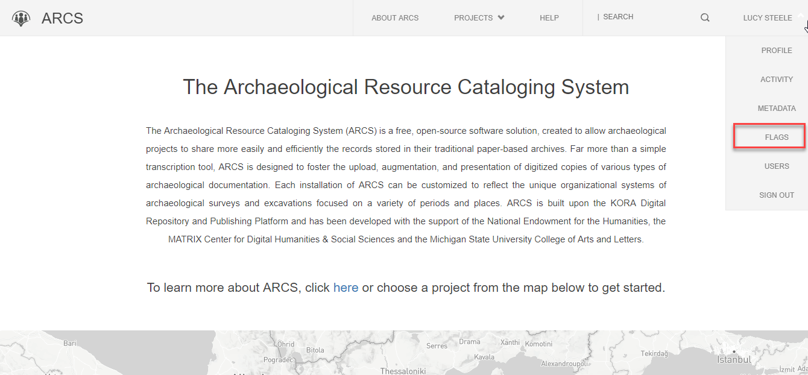
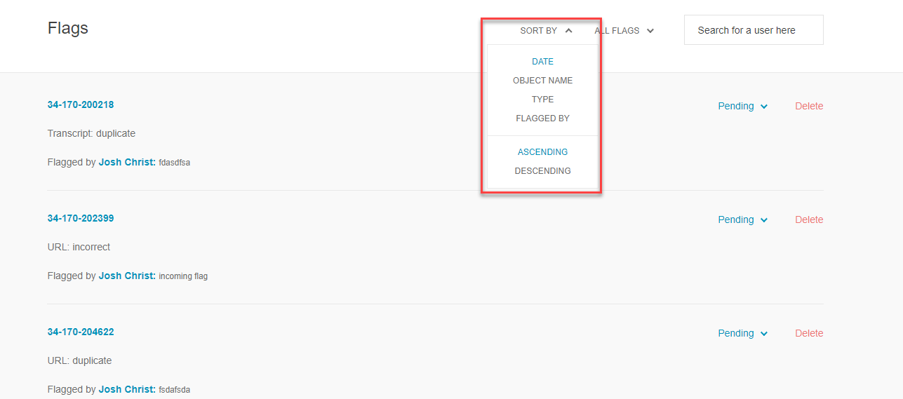
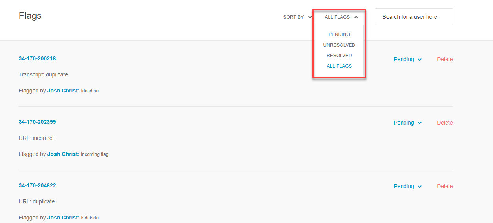
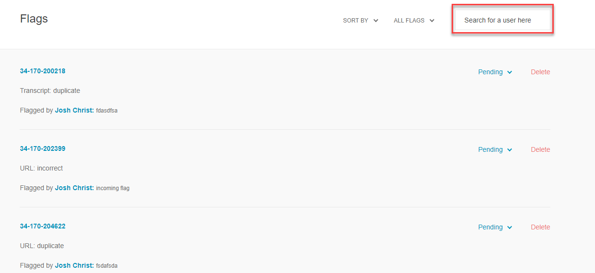
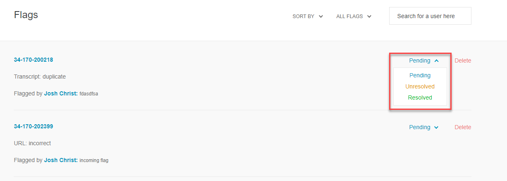
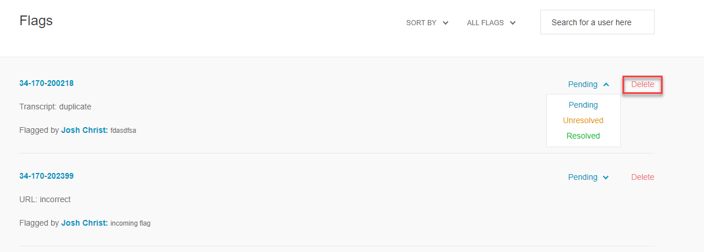

**8. Resolve Flag**

ARCS is dependent on user engagement with the resources. Users have the ability to flag metadata that they believe to they believe to be incorrect, duplicate, spam or having another problem. As an administrator you can resolve these flags to ensure that your ARCS project is as correct as possible.

To resolve a flag,

1. Select **Flags** from the drop-down menu under your name.

2. On the **Flags** page, you can sort the flags by **Date, Object Name, Type** or **User** who created the flag by using the **Sort By** drop down menu.

3. Filter the flags by their pending status by using the **All Flags** drop-down. Here you can show the **Resolved, Unresolved,** or **Pending** flags.

4. Search for a specific researcher's flags by using the **search bar** to the far right.

5. Click the arrow next to the **Pending** to open the menu for options of resolution. Here you can select if the flag is **Resolved, Unresolved,** or still **Pending.**

6. Next to the Pending menu, you can click **Delete** to remove the flag entirely.

