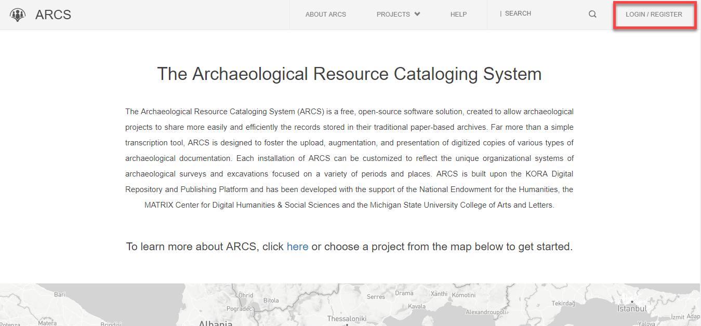
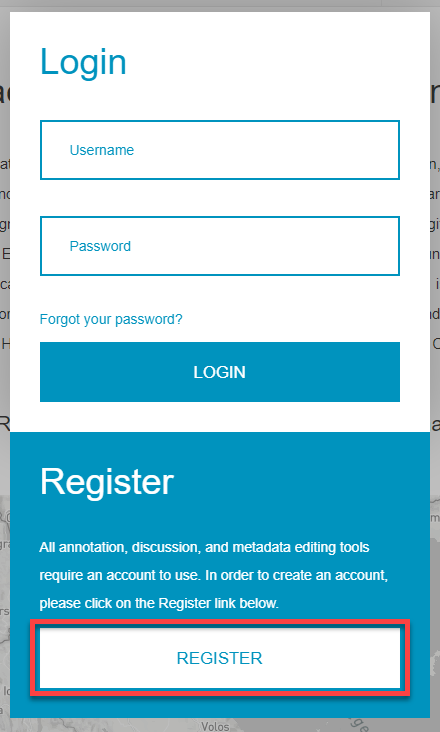
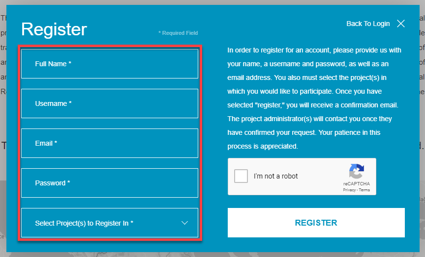
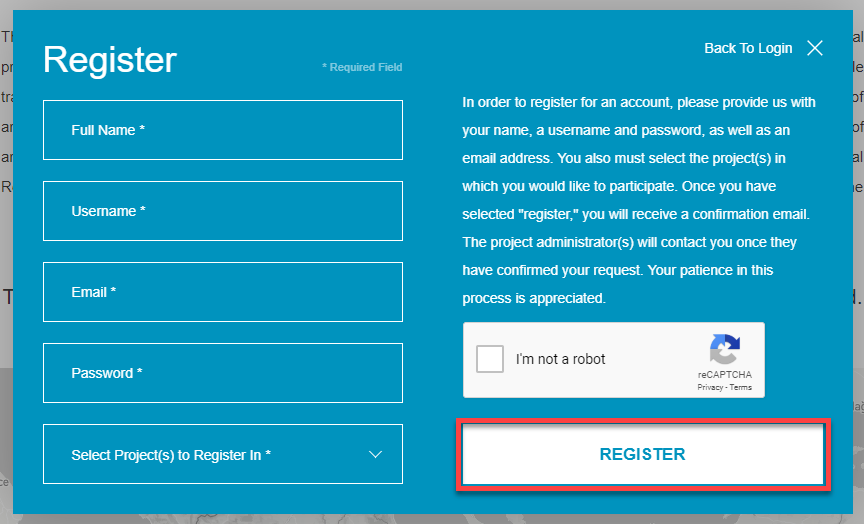

**(1.) Create an ARCS Account**

To be able to access all the capabilities of ARCS, such as annotations, contribute metadata edits or engage in discussion, you will need an account. There are only a few steps between you and the ability to contribute to an ARCS project!

To create an account for ARCS:

1. Click on the **Login/Register** button in the top right corner of the Main Page. This will open a Login/Register window.

2. Click **Register** underneath the Login option.

3. Enter the required information, including your **name, username, email, desired, password,** and the **project** you wish to register for.

4. To finish registering for an account, click **Register**. You will receive a confirmation email from the project administrator(s) once they have confirmed your registration request.

