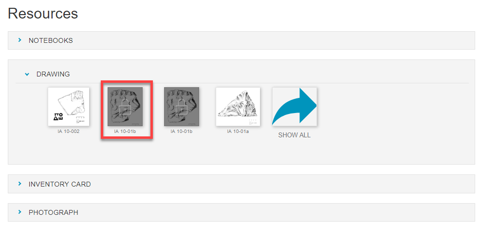
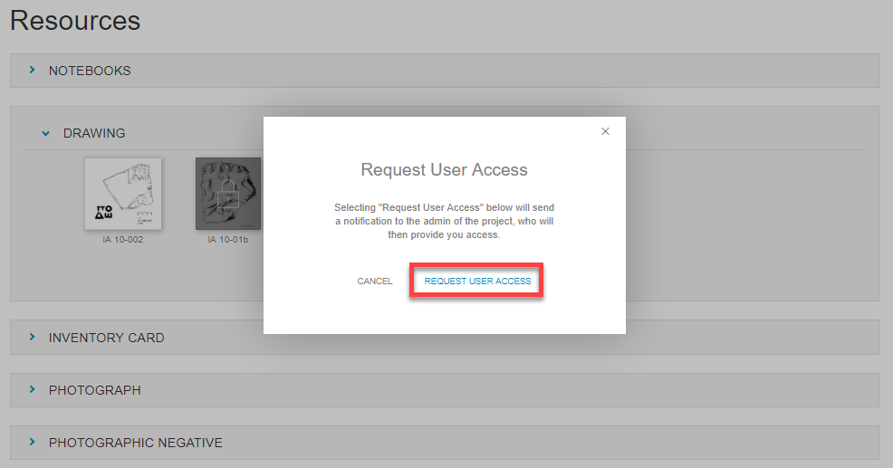
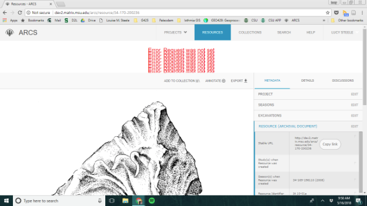

**13. Request Access to a Locked Resource**

There may be resources within your ARCS project you do not have access to. If there is a resource you would like to view but it is locked, you can request access from the project administrator.

1. Click the **locked resource** you would like to view.

2. A pop-up box will open that details about user access of the resource.

3. Select **Request User Access** which will notify the administrator of the project who can provide you with access.

**Currently, this gives an error when moving to the next page.** --> **Bug Submitted, as of 7/25 is still not resolved.**

