**14. Create a Collection**

As a researcher in ARCS, you can create Collections to group and save resources you find on the site. There are published to your profile and other users have the ability to search for and use your collections. There are two channels through which you can make a collection.

Bulk selection:

1. While viewing an entire collection or resource type, click the **top left corner** of the resource(s) to select multiple at a time.

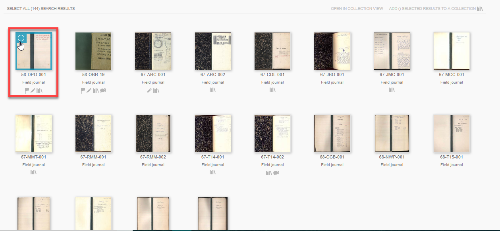

2. Click **Add to Collection** in the top right once you have made your selection(s).

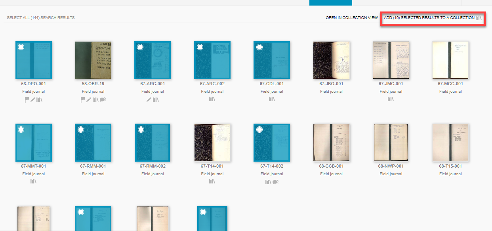

3. A pop-up tab called **Add to Collection** will open.

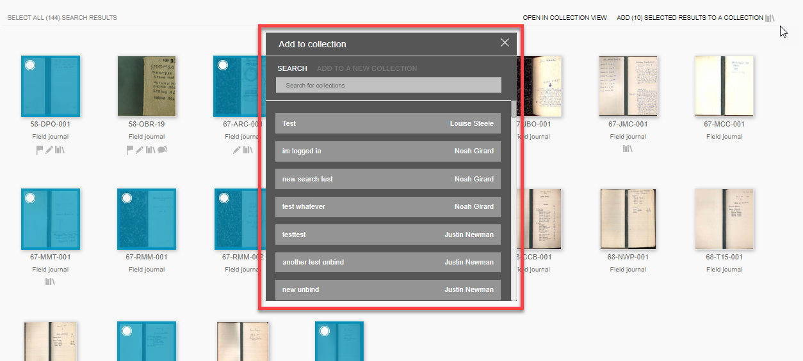

4. Navigate to **Add to a New Collection** in the tab.

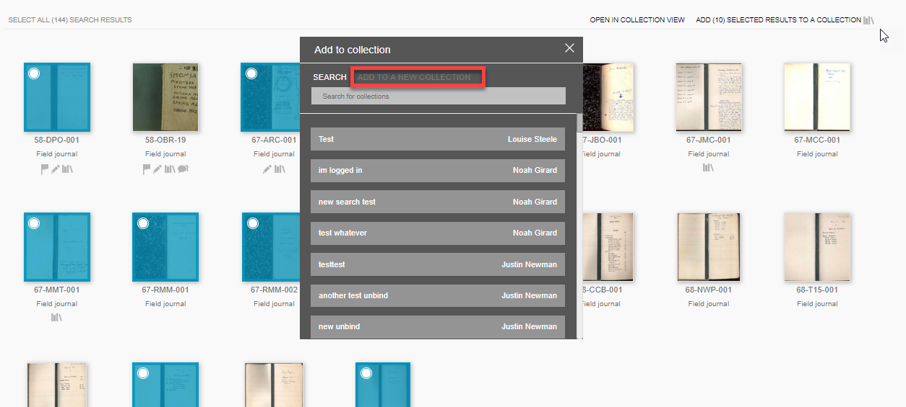

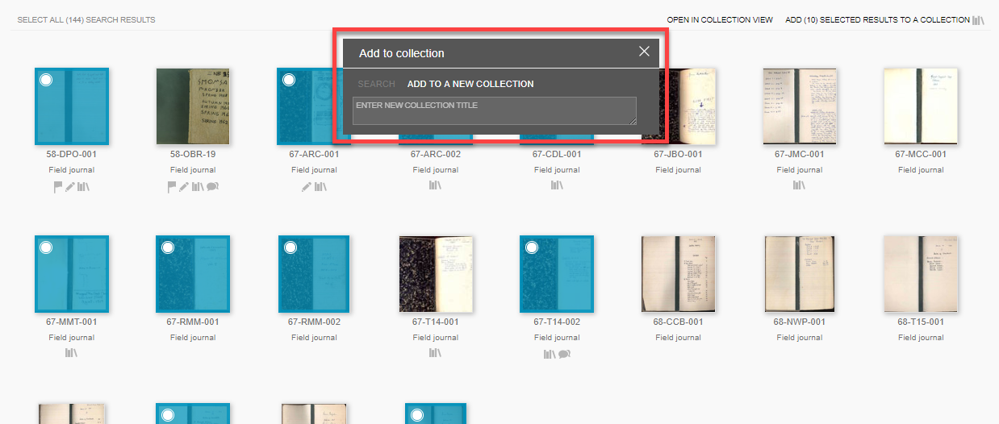

5. Entering a **title** here will create your new collection.

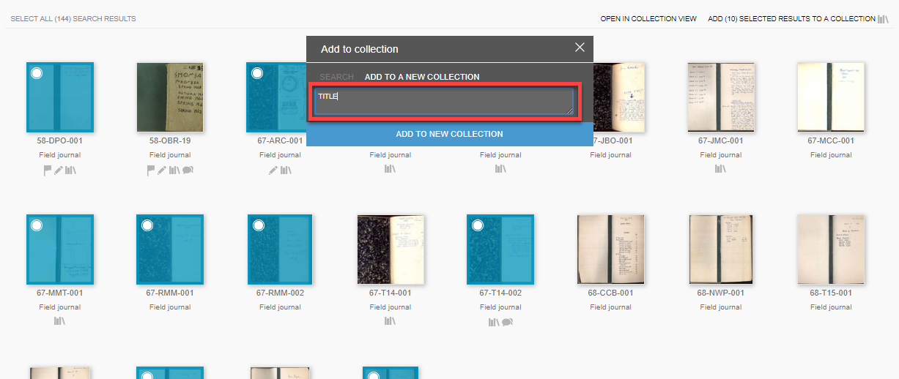

6. Save by clicking **Add to New Collection.**

7. Your selected resources will be added directly to your new collection.

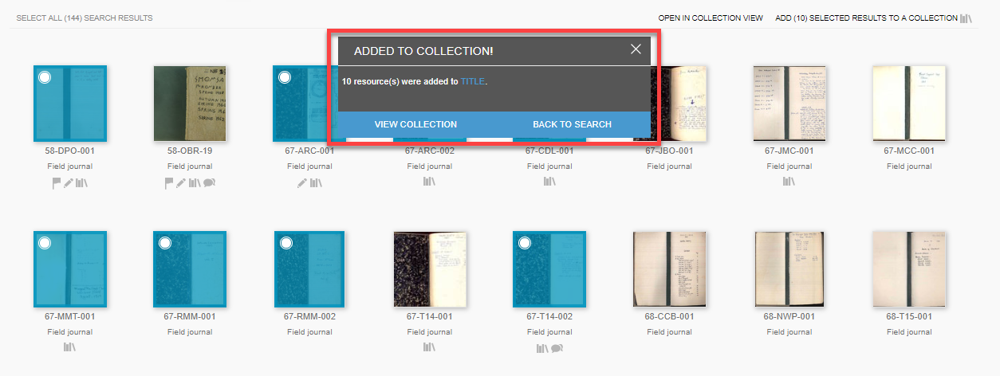

Single Selection:

1. While viewing a resource in Resource View, click **Add to Collection.**

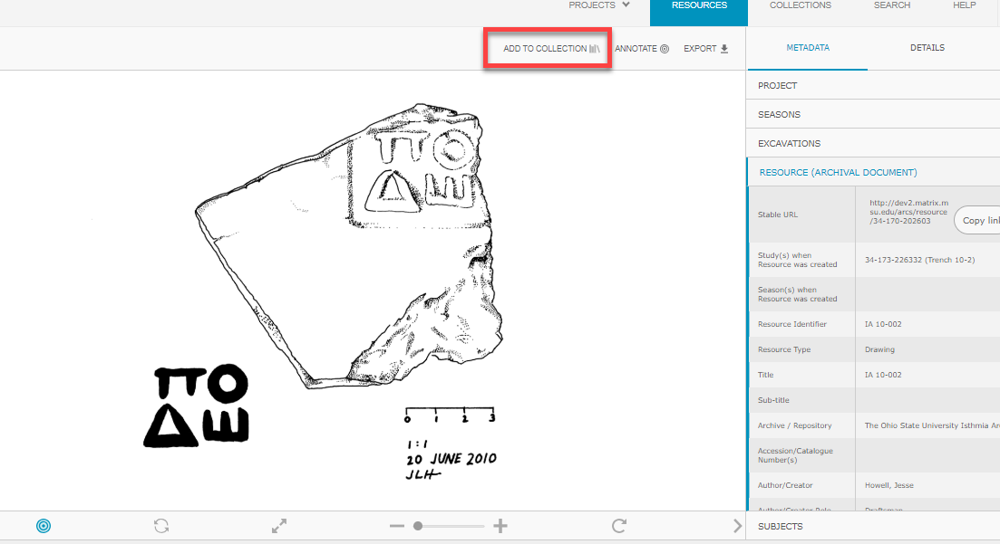

2. This will open a pop-up tab called Add to Collection. Click **Add to a New Collection** to the right of the tab.

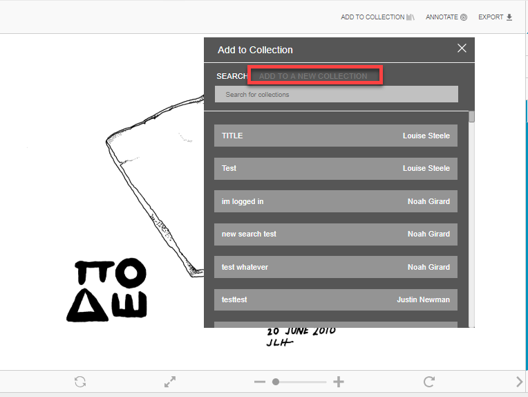

3. Create a new collection by entering a **title.**

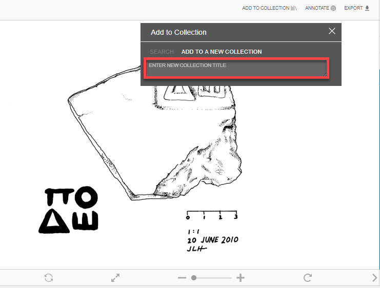

4. Save by clicking **Add to New Collection**

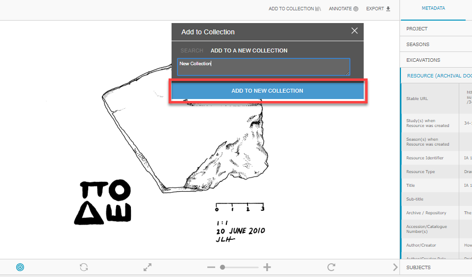

5. The resource you are viewing will be the first item in your new collection.

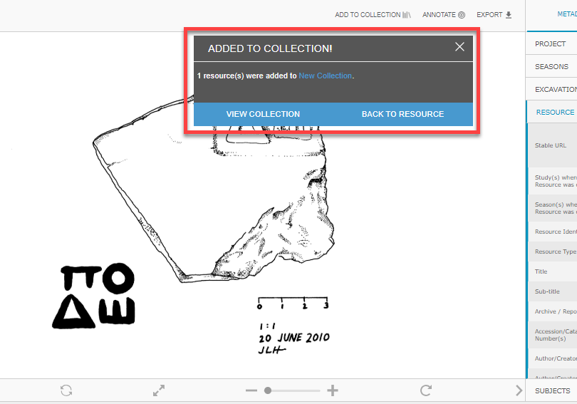

6. Your collection is published on your profile after it is created. If you would like to edit it, click **Edit Collection** once your collection is opened.

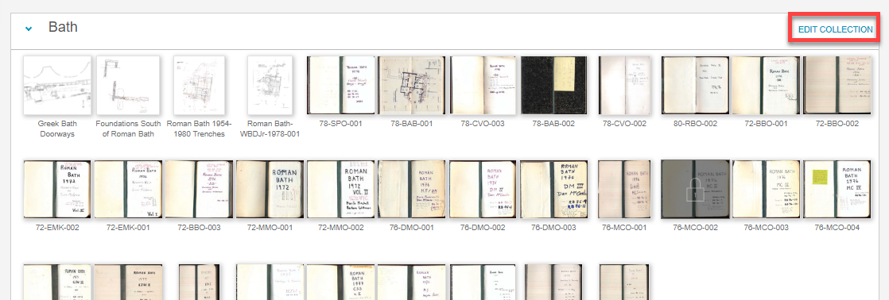

7. Here you can choose who can view your collection. Your collection can be **completely public, require an account on ARCS to view, be accessible for only selected users** or **completely private** where only you can view it.

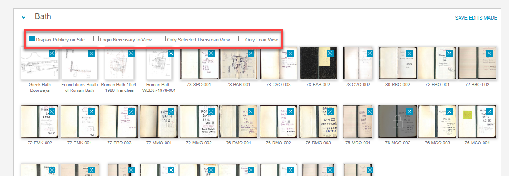

8. Click the **blue Xs** in the top right of the resources to remove them from your collection.

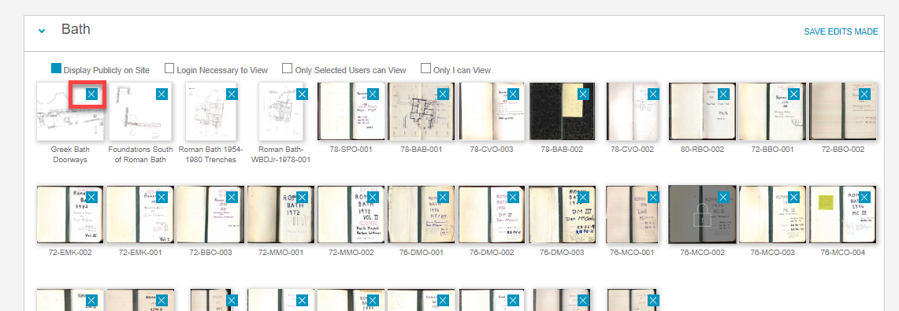

9. Click **Save Edits Made** to finalize your changes to the collection.

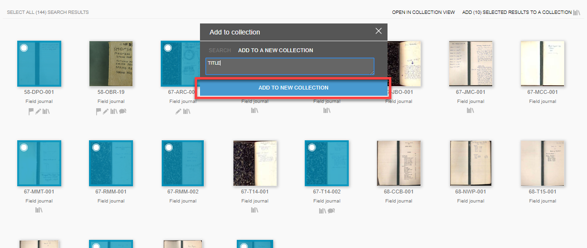
