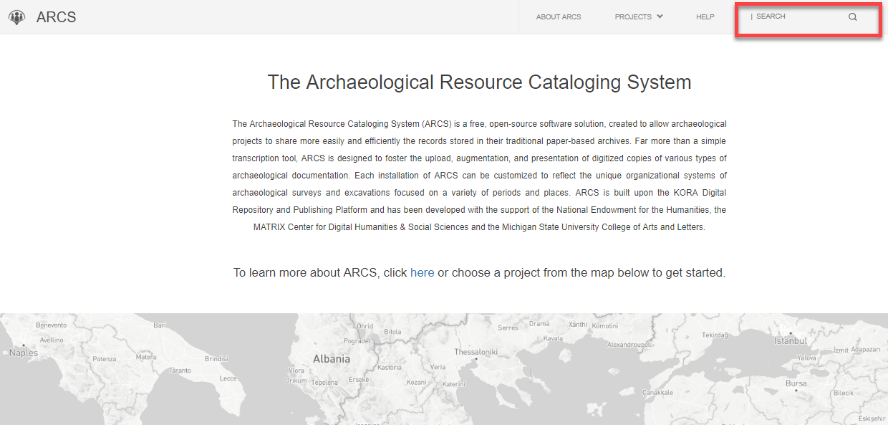
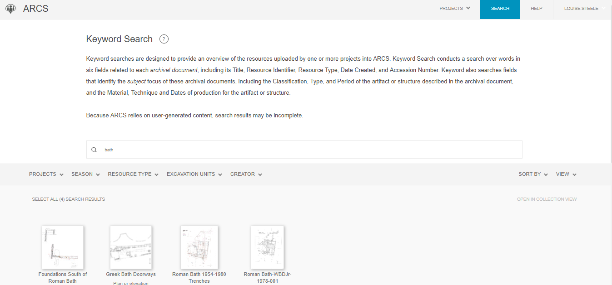
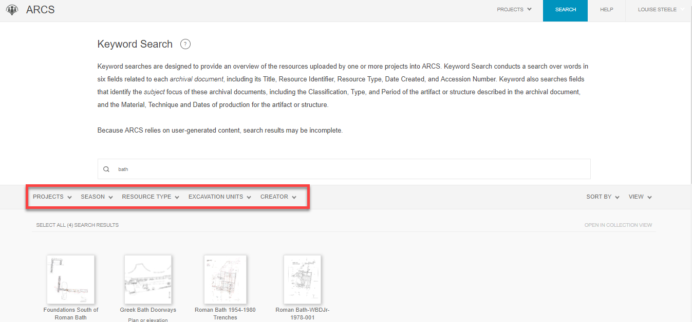
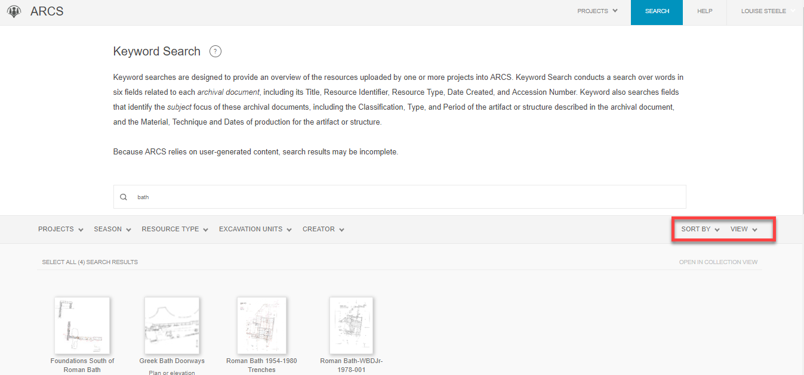
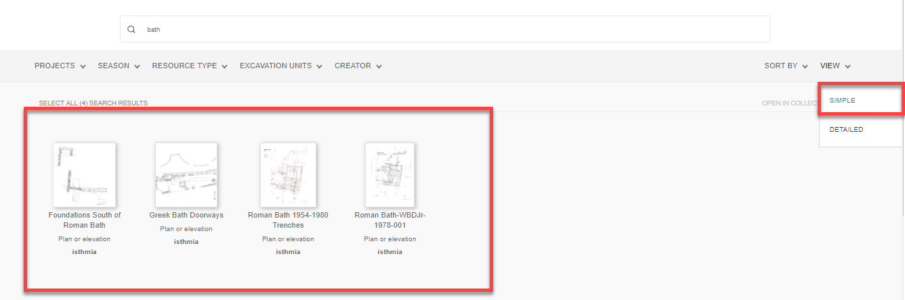
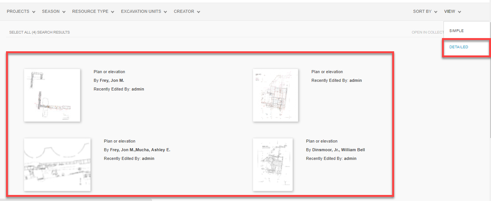

**18. Cross-Project, Basic and Advanced Searches**

You can do a Cross-Project Search to find resources across projects with a simple Keyword Search starting from the ARCS main landing page.

1. Enter  your keyword(s) in the **search bar** at the top of the main ARCS landing page. You can enter more than one word or phrase and separate them by a comma.

a. Note that when entering multiple words, the Keyword Search will generate results where *all* words in the search are present in *any* of the fields. Click the circled question mark next to Keyword Search for more information about this process and specific help with searching dates.

2. This will bring you to the Keyword Search with results from all projects on ARCS.

Once your results are generated you can:

1. **Filter** them by the fields at the top of the results page: select the specific **Season, Resource type, Excavation Unit** or the **Resource Creator.**

2. **Sort by** ascending or descending as well as select the viewing option to be either "Simple" or "Detailed."

3. Simple View:

4. Detailed View:

Advanced Cross-Project Search:

1. ** There does not appear to be an 'Advanced Search' option from the search results that are from the ARCS landing page. When attempting an Advanced Search within a project, it does not have an option to change the project(s) that are being searched. **
