**4. Navigating the Resource View**

The interface to view details about a resource is called the **Resource View.** This interface is packed with functionality so that ARCS users can best interact with both the resource and each other. There are three main components to this interface: The top tray, the interactive window, and the side tray.

The top tray of the Resource View provides options to work with the data in other locations.

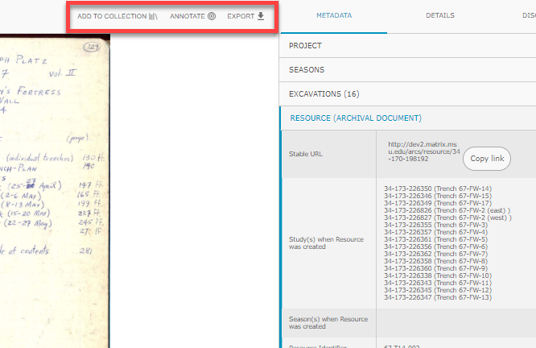

1. You can save the object to a collection by selecting **Add To Collection** and either searching for a known collection or creating a new collection

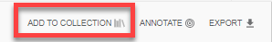

2. To add an annotation, select **Annotate**. There is more detail for this function under **Add an Annotation.**

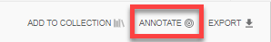

3. By clicking **Export**, you can download the object you are viewing. Exporting a resource will download a folder containing .json files that compromise metadata and the images associated with the resource.

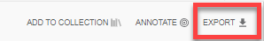

The object will be displayed in an interactive inset to the left of the page.

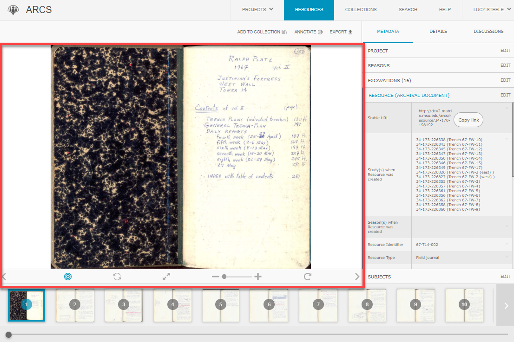

1. Here you can scroll around the image using your mouse.

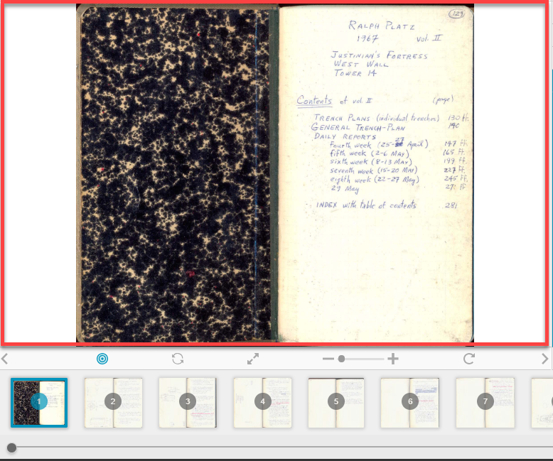

2. Underneath the image, there are options to **zoom in or out.**

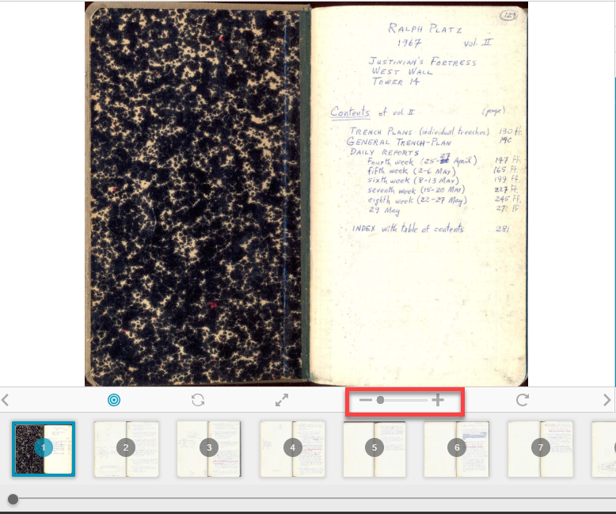

Make it **full screen,**

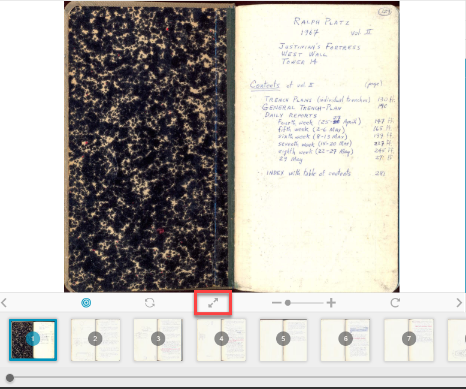

and **rotate.**

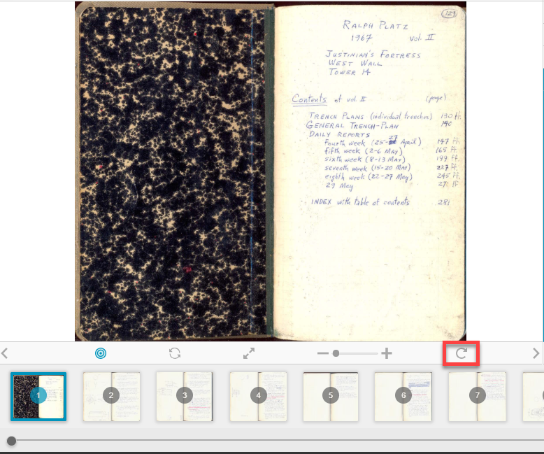

3. To reset the resource to the original zoom and rotation, click the **Refresh Arrows** in the bottom tray.

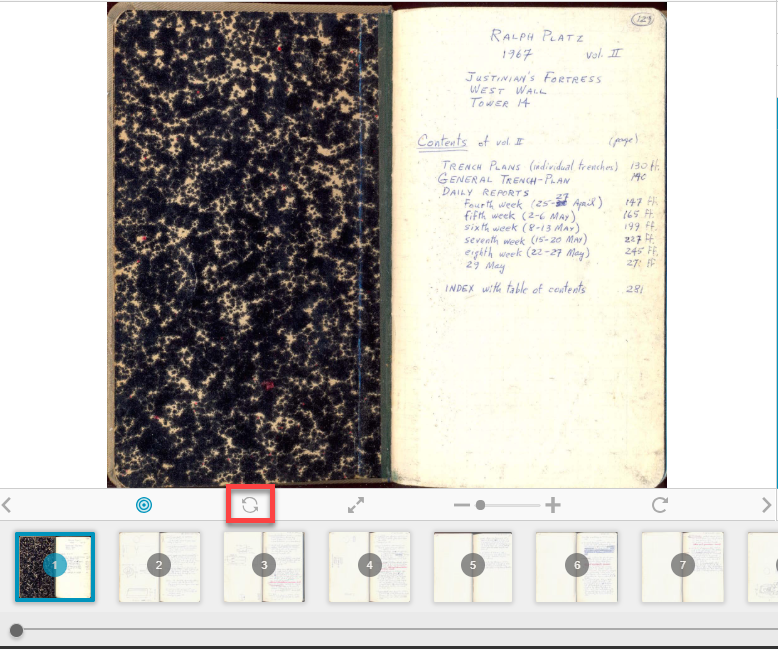

4. To toggle the annotations on or off, click the **Annotate icon** in the bottom tray.

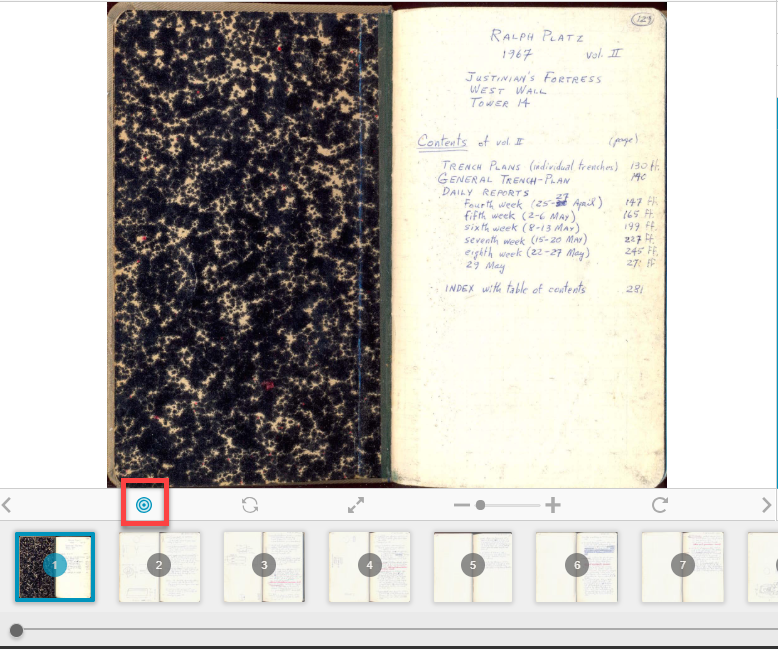

5. If you are viewing an object with multiple pages, such as a field journal, the **arrows** along the bottom will change to the next page or you can select a specific page from the tray underneath. If you selected multiple resources for collection view then the arrows will navigate between separate resources.

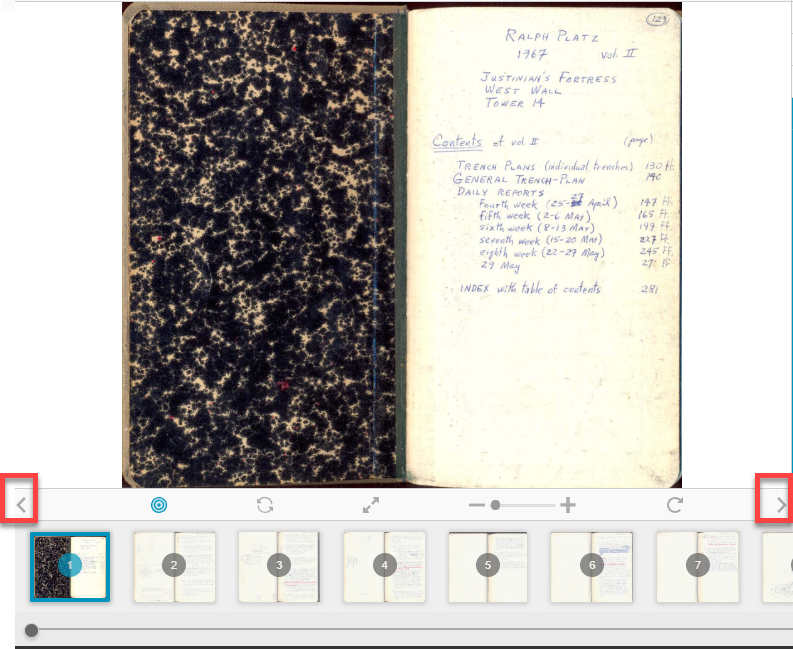

6. You can select a specific page or navigate to certain resource by **scrolling** through the pages underneath the interactive window.

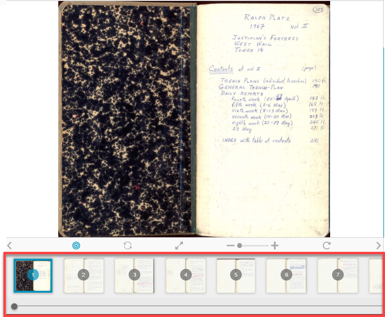

The side tray provides information about what is being displayed. There are tabs for Metadata, Details, and Discussions in this tray.

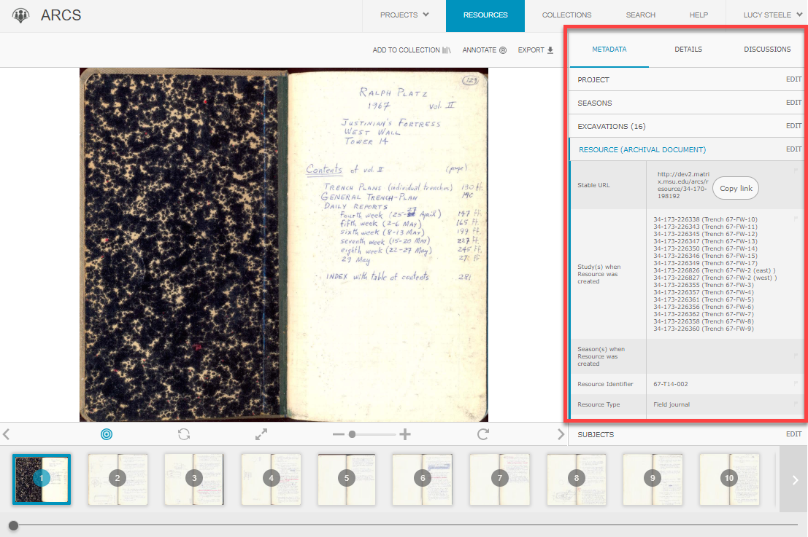

1. The **Metadata** tab moves from broad to specific as you move from top down, starting with the overall project and moving through seasons, excavations, resource and the subject.

a. If you see metadata that is incorrect, a duplicate or some other error, see "Editing Metadata" for how to make changes to the resource's metadata.

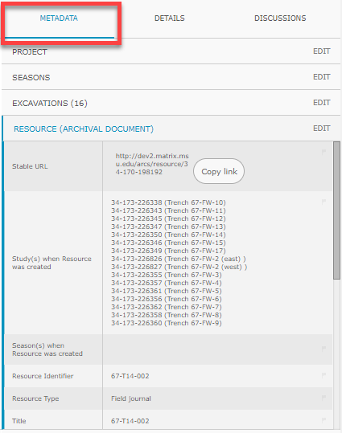

2. Under **Details** you can find transcriptions, annotations, searchable keywords and the collections that the object are saved to.

a. If you would like to make a transcription or annotation to the resource you are viewing look to the "Contributing a Transcription" and/or "Add an Annotation."

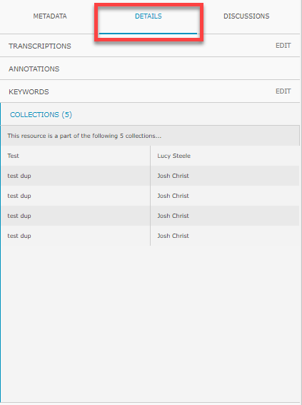

3. The **Discussions** tab will house discussions from users about the object.
a. For how to participate in discussions, see "Discussions --posting, replying, notifications."

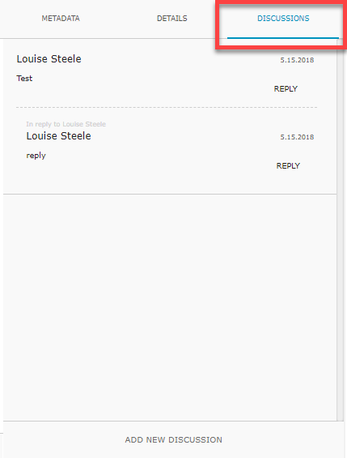
