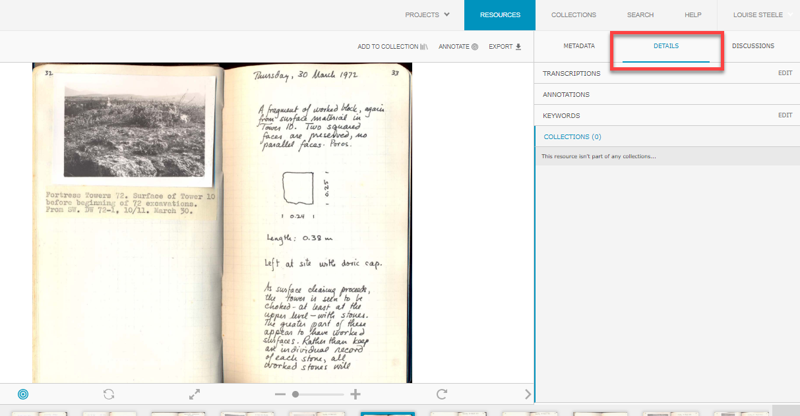
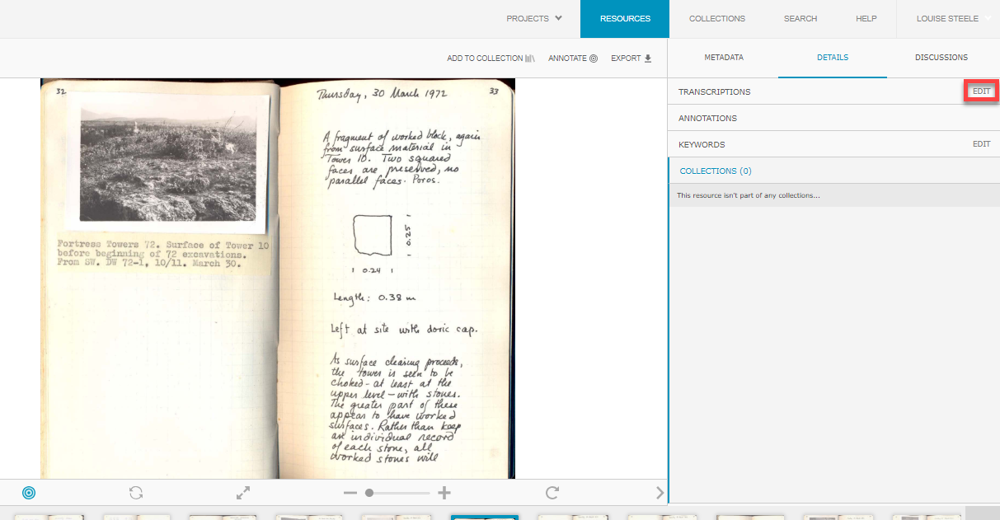
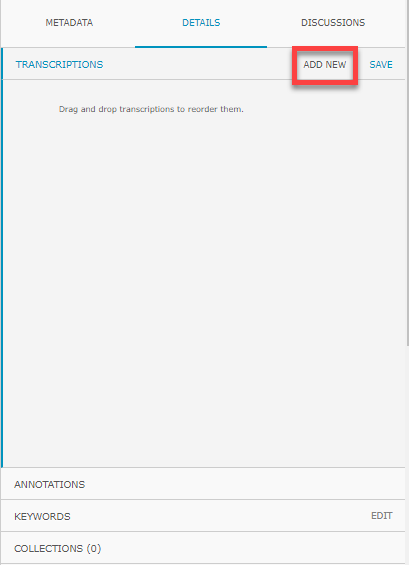
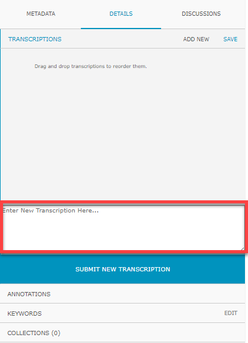
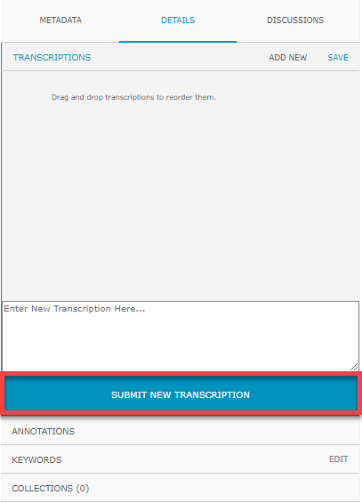
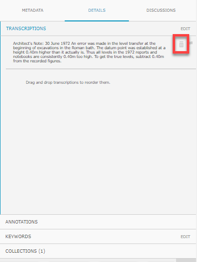
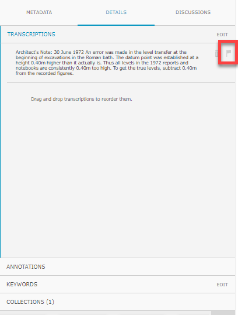

**8. Contributing a Transcript**

As with the rest of ARCS websites, transcriptions are user-generated. You can find these transcriptions in the Details tab of collections view for a resource. If you would like to become involved in the aspect of ARCS, there is an easy step to do so.

1. Navigate to the **Details** tab in collections view.

2. Click **Edit** on the Transcriptions tab.

3. Select **Add New**.

4. This will open a small box at the bottom of the Transcriptions tab where you can **enter the transcription text.**

5. When you have finished your transcription, click **Submit New Transcription.**

6. If you would like to **delete** your transcript, click the **trash can icon** in the top right of your transcript.

7. If there is a duplicate, errors, spam, or some other problem with a transcription you can **flag** any transcription with the **flag icon** in the top right of the transcript in question. This process works the same way as flagging metadata. For more information on creating a flag, see "Create a Flag."

